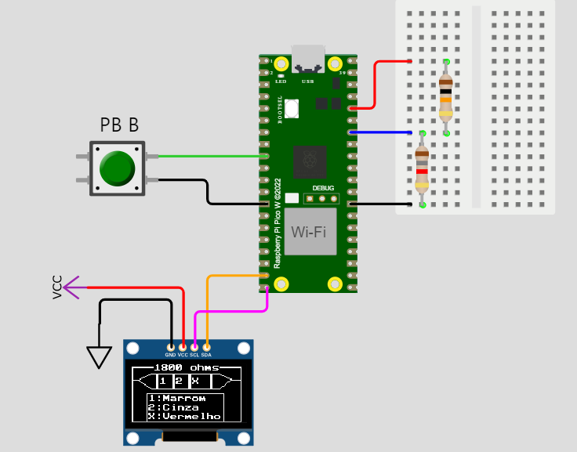

# 🔌 Ohmímetro com Reconhecimento Automático do Código de Cores — BitDogLab

# 📋 Descrição
Este projeto consiste na criação de um ohmímetro inteligente utilizando a placa BitDogLab (RP2040).
O sistema realiza a leitura de resistores através de um divisor de tensão, calcula seu valor, identifica o valor comercial mais próximo da série E24 (5%), e determina automaticamente as três primeiras faixas do código de cores.

Essas informações são exibidas no display OLED SSD1306 (128x64), incluindo:

- Valor numérico da resistência;

- Código de cores correspondente (1ª, 2ª faixa e multiplicador);

- Representação gráfica estilizada de um resistor com as faixas desenhadas.

# 🎯 Funcionalidades
**📈 Leitura da resistência usando o ADC do RP2040.** 
**🎯 Aproximação automática para o valor E24 mais próximo.**
**🎨 Conversão para o código de cores padrão dos resistores.**
**🖥️ Exibição no display OLED (SSD1306):**
- Valor do resistor;
- Nome das cores de cada faixa;
- Desenho de um resistor com marcação das faixas.

**🔄 Média de 500 leituras ADC para maior estabilidade.**
**🛠️ Modo BOOTSEL utilizando botão para regravar firmware (Botão B).**

# 🖥️ Visualização no Display
**Topo: Valor da resistência em ohms**
**Centro: Desenho de um resistor com faixas estilizadas:**
- Faixa 1 (1º dígito)
- Faixa 2 (2º dígito)
- Multiplicador (potência)

**Base: Legenda com as cores correspondentes.**

# ⚠️ Observação Importante
Atenção: No simulador Wokwi, a leitura do pino ADC 28 pode não funcionar corretamente.
Para testes físicos reais, descomentar a linha de leitura do ADC e comentar a linha de valor fixo no código.

# Autor
Leonam S. Rabelo